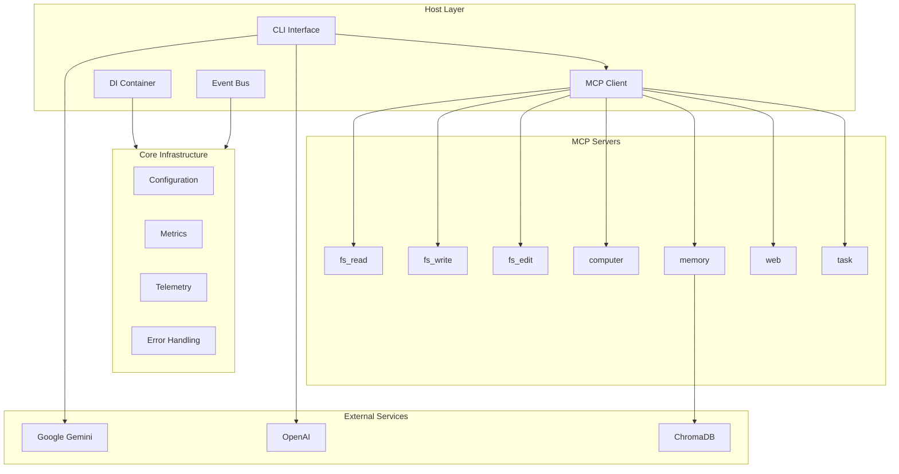

# Polymath

**Polymath** 是一个基于 **MCP (Model Context Protocol)** 架构的通用 AI 智能体，旨在成为你的全能数字副手。它不仅能写作，还能阅读代码、分析数据、识别图像，并拥有长期记忆。

## Architecture



## Features

### v0.4.1 (Enterprise Infrastructure)

- **Parallel Connections**: MCP servers connect in parallel for faster startup
- **Result Caching**: Intelligent caching with TTL for read operations
- **Circuit Breaker**: Automatic fault isolation for failing servers
- **Retry Policy**: Exponential backoff with jitter for transient errors
- **Metrics Collection**: Counter, Gauge, Histogram metrics
- **Distributed Tracing**: Span-based tracing across tool calls
- **User-Friendly Errors**: Localized error messages (EN/ZH)

### v0.4.0 (Multi-Mode Agent)

- **Expert Modes**: Switch between specialized personas
  - **Default**: General assistant
  - **Plan (`/mode plan`)**: Strategic planning and task breakdown
  - **Build (`/mode build`)**: Implementation and execution
  - **Coder (`/mode coder`)**: Code quality and testing focus
  - **Architect (`/mode architect`)**: System design and documentation
- **Code Intelligence**: AST parsing, symbol navigation
- **Task Management**: Built-in todo list with MCP server

### Core Features

- **MCP Architecture**: Client-Server model for unlimited extensibility
- **Multi-modal Vision**: Gemini Vision and GPT-4o support
- **Long-term Memory**: ChromaDB-based vector storage
- **File Processing**: PDF, Word, PPT, Excel, images
- **Code Execution**: Sandboxed Python interpreter
- **Security**: Path jailing, HITL approval, resource limits

## Quick Start

### Installation

```bash
# Clone
git clone https://github.com/polymath-ai/polymath.git
cd polymath

# Install
pip install -e .

# Or with dev dependencies
pip install -e ".[dev]"
```

### Configuration

Create `.env` in project root:

```bash
GOOGLE_API_KEY="your_google_api_key"
OPENAI_API_KEY="your_openai_api_key"  # Optional
```

### Run

```bash
# Start CLI
pl start

# With specific project (isolated memory)
pl start --project "MyProject"
```

## Commands

| Command | Description |
|---------|-------------|
| `/help` | Show all commands |
| `/mode <name>` | Switch mode (plan/build/coder/architect) |
| `/tasks` | View task list |
| `/tasks-clear` | Clear all tasks |
| `/debug` | Show debug info |
| `/exit` | Exit Polymath |

## MCP Servers

| Server | Tools | Description |
|--------|-------|-------------|
| `fs_read` | `read_file`, `list_directory`, `glob_files`, `grep_search`, `find_symbol` | File reading and code navigation |
| `fs_write` | `write_file` | File writing |
| `fs_edit` | `edit_file` | File editing with diff |
| `computer` | `execute_python`, `install_package` | Sandboxed code execution |
| `memory` | `save_note`, `search_notes` | Vector-based long-term memory |
| `web` | `fetch_url`, `web_search` | Web content fetching |
| `task` | `task_create`, `task_list`, `task_update_status` | Task management |

## Project Structure

```
polymath/
├── src/
│   ├── core/           # Core infrastructure
│   │   ├── container.py      # Dependency injection
│   │   ├── configuration.py  # Hierarchical config
│   │   ├── events.py         # Event bus (pub/sub)
│   │   ├── metrics.py        # Metrics collection
│   │   ├── errors.py         # Error handling
│   │   └── telemetry.py      # Logging & tracing
│   ├── host/           # CLI host
│   │   ├── cli.py            # Main CLI
│   │   └── client.py         # MCP client
│   ├── servers/        # MCP servers
│   └── services/       # Shared services
├── tests/              # Test suite
└── docs/               # Documentation
```

## Security

- **HITL (Human-in-the-loop)**: Sensitive operations require user approval
- **Path Sandboxing**: File operations restricted to workspace
- **Resource Limits**: Code execution has memory/CPU/time limits
- **Circuit Breaker**: Automatic isolation of failing services

## Configuration

### Environment Variables

| Variable | Description | Default |
|----------|-------------|---------|
| `GOOGLE_API_KEY` | Gemini API key | Required |
| `POLYMATH_MODEL` | LLM model | `gemini-2.0-flash` |
| `POLYMATH_LOG_LEVEL` | Log level | `INFO` |
| `POLYMATH_MAX_MEMORY_MB` | Code execution memory | `512` |

### Config File

`.polymath/config.json`:

```json
{
  "mcpServers": {
    "memory": {
      "command": "python3",
      "args": ["src/servers/memory.py"]
    }
  },
  "persona": {
    "name": "Polymath",
    "role": "AI Assistant"
  },
  "sensitive_tools": [
    "execute_python",
    "write_file"
  ]
}
```

## Development

```bash
# Install dev dependencies
pip install -e ".[dev]"

# Run tests
pytest tests/ -v

# Run with coverage
pytest tests/ --cov=src --cov-report=term-missing

# Lint
ruff check src/ tests/

# Format
ruff format src/ tests/
```

See [docs/development.md](docs/development.md) for detailed development guide.

## Documentation

- [API Reference](docs/api.md) - Complete API documentation
- [Development Guide](docs/development.md) - How to extend Polymath
- [Contributing](CONTRIBUTING.md) - Contribution guidelines

## License

MIT License - see [LICENSE](LICENSE) for details.

## Acknowledgments

- [Model Context Protocol](https://modelcontextprotocol.io) - The foundation
- [Google Gemini](https://ai.google.dev) - LLM provider
- [ChromaDB](https://www.trychroma.com) - Vector database
- [Rich](https://rich.readthedocs.io) - Beautiful terminal output
